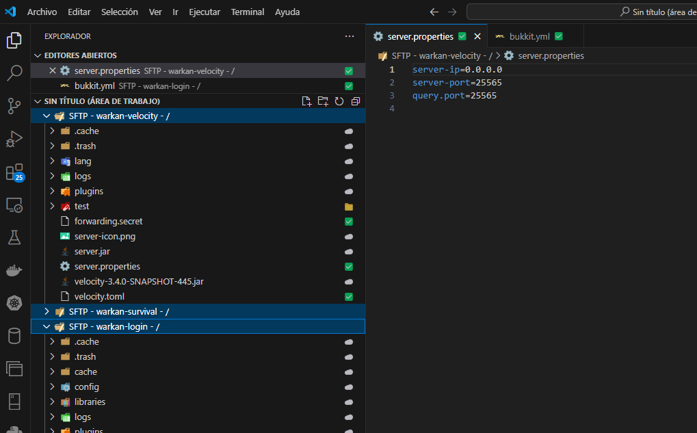

# SFTP FS

An extension that provides a fast and optimized file system for the SFTP protocol with the advantage of parallel operations.

## Features

* Optimized for fast operations.
* Connection management with the ability of use and re-use many SFTP connections at same time to do parallel operations, decreasing the cost of heavy operations like downloading/uploading a high amount of files.
* Easy sync of your files between Operating System File Explorer and your SFTP Server.
* Easy manipulation of folders and files from the File Explorer of VS Code.
* Manage multiple SFTP workspaces at same time:



## Requirements

* A SFTP server to connect.
* VS Code 1.95.0 or higher (if you are not able to update to this version and want to use this extension please fill a request at Github and I will take a look).

## Extension Settings

This extension contributes the following settings:

#### Behavior
* `sftpfs.behavior.notification.upload.fileSize`: Show a progressive notification when a file has a size greater than the specified amount of Kilobytes, useful to know the current progress of the upload operation.
* `sftpfs.behavior.notification.download.fileSize`: Show a progressive notification when a file has a size greater than the specified amount of Kilobytes, useful to know the current progress of the download operation.

#### Pool configuration

> App uses two type of pool: a **passive** and a **heavy** pool.
> 
> The **passive** pool is used for non expensive operations like listing a directory, open a file, rename a folder/file, etc.; you should set lower values for this pool.
> The **heavy** pool (as opposed of passive pool) is used for very expensive operations like downloading/uploading a high amount of files, you should set higher values for this pool depending of the limitations of your SFTP server (some servers may be very restrictive in the amount of connections that a user can open at same time).

The following configurations are applicable for both type of Pools, replace `<type>` with the appropriate type: `passive` or `heavy`
* `sftpfs.pool.<type>.max`: Maximum number of connection to open at same time, take in consideration that the SFTP server may restrict the total amount of multiple connections at same time.
* `sftpfs.pool.<type>.min`: Minimum amount of connection to keep in the pool for future requests, at least make it to be 1/3 of the maximum connections for better performance, for example if maximum connections is 15 set this to 5.
* `sftpfs.pool.<type>.minIdle`: Amount of connections to keep as idle, a connection is marked as idle when it is released after a SFTP operation, so it can be re-used for next operations without the needing of re-open the connection.
* `sftpfs.pool.<type>.maxQueue`: Maximum amount of requests to keep in queue if all connections are in use, we recommend to keep it as high as posible, for example 1_000_000, because extension does many operations in paralell form, so multiple acquire requests are queued at same time to perform the operation.
* `sftpfs.pool.<type>.idleTimeoutMillis`: Time in milliseconds to keep a connection as idle, idle connections will be closed if not are used after the timeout is reached.

#### Remote configuration

There is two ways that you can use to add a remote configuration to extension.

1. Using the command (in Windows CTRL + SHIFT + P) and choosing "SFTP FS: Add remote..."
2. Editing the configuration directly.

For the way #2, edit your settings.json file and add the following configuration:

```
"sftpfs.remotes": {
  "YourNameForThisRemote": {
    "host": "YourSFTPHost",
    "port": 22,
    "username": "YourSFTPUsername",
    "password": "YourSFTPPassword",
    "remotePath": "/"
  },
  ...
  ...
  ... // Add as many as you need
},
```

#### Working Directories

The configuration `sftpfs.workDirs` is edited by the extension automatically when you select a folder to synchronize remote files to your local storage.

```
"sftpfs.workDirs": {
  "RemoteName": {
    "workDir": "/C:/MyPath/For/Local/Folder"
  }
},
```

## Known Issues

* Editing files locally (via the Operating System File Explorer for example) are not reflected instantly in the File Explorer of VS Code, I am working on a update to implement this feature.

## Release Notes

Users appreciate release notes as you update your extension.

### 1.0.0

Initial release of the extension with many features:

* Ability to view, create, edit, delete, move, rename files/directories from the File Explorer of VS Code.
* Ability to download a whole directory from SFTP to local (right-click a folder and choose Sync Local -> Remote in the contextual menu).
* Ability to upload a whole directory from local to SFTP (right-click a folder and choose Sync Remote -> Local in the contextual menu).
* Ability to sync folder between both directions, local <-> SFTP (right-click a folder and choose Sync Remote <-> Local in the contextual menu).
* Added configurations to manage settings for STO connection pools used by the extension.
* Added an option in contextual menu to disconnect from SFTP server.
* Added an option in contextual menu to remove local copies of remote files without deleting remote files (right-click a folder and choose Remove local file).

----

_Made with love by the LewLie team 🦊🐺_