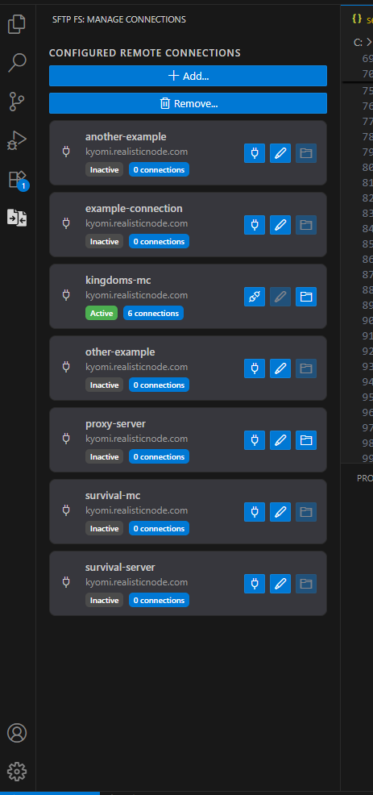
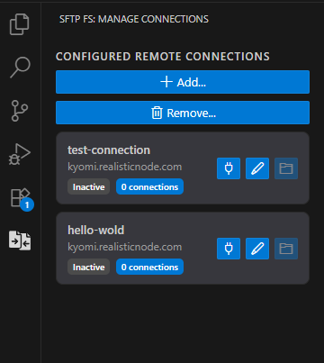

# SFTP File System

A fast and optimized SFTP file system extension, enabling you to work with SFTP files more efficiently than ever before!

## Features

### ✨ Optimized SFTP File System with Parallel Operations

Say goodbye to manual file synchronization. This extension streamlines your workflow by enabling fast and efficient parallel downloads and uploads.

This is possible thanks to its excellent handling of simultaneous SFTP connections, which boosts speed and efficiency when working with multiple SFTP files at the same time.


### ⚙️ Highly Configurable

Adapt the extension to your specific needs with a wide range of configuration options.


### ⚡ Effortless File Manipulation

Sync your local and remote files with ease. The extension automatically handles all necessary upload and download operations by checking the current state of your files.


### 🚀 Work with Multiple Workspaces

Manage multiple SFTP folders simultaneously in a single, unified interface.


### 🗃️ Manage Your Remote Connections Easily

Easily manage your Remote SFTP connections with the integrated activity bar. Quickly switch between connections, view their status, and perform common actions without leaving your current workspace.



## 📋 Requirements

* An SFTP server to connect to.
* VS Code 1.93.0 or higher. If you need support for an older version, please open an issue on GitHub.

## ⚙️ Extension Settings

This extension contributes the following settings:

### 🛠️ Behavior
* `sftpfs.behavior.notification.upload.fileSize`: (Upload) Display a progress notification for uploads of files exceeding the specified size in kilobytes, making it easy to track upload progress.
* `sftpfs.behavior.notification.download.fileSize`: (Download) Display a progress notification for downloads of files exceeding the specified size in kilobytes, making it easy to track download progress.

### 📦 Cache
* `sftpfs.cache.metadata.files.seconds`: Specifies how long, in seconds, file metadata is cached to improve performance for operations like directory listing and bulk file transfers.

### 🦊 Pool configuration

> The extension utilizes two types of connection pools: a **passive** pool and a **heavy** pool.
> 
> The **passive** pool is designed for lightweight operations such as listing directories, opening files, and renaming. Lower values are recommended for this pool.
> 
> The **heavy** pool is used for resource-intensive operations like downloading or uploading large numbers of files. Higher values are recommended, but be mindful of your SFTP server's connection limits.

The following configurations apply to both types of pools. Replace `<type>` with the appropriate pool type: `passive` or `heavy`.

* `sftpfs.pool.<type>.max`: The maximum number of simultaneous connections.
* `sftpfs.pool.<type>.min`: The minimum number of connections to maintain in the pool. For optimal performance, it's recommended to set this to at least one-third of the `max` value.
* `sftpfs.pool.<type>.minIdle`: The number of idle connections to maintain. An idle connection is one that has been released after an operation and is available for reuse, which avoids the overhead of reopening a connection.
* `sftpfs.pool.<type>.maxQueue`: The maximum number of requests to queue when all connections are in use. A high value (e.g., 1,000,000) is recommended, as the extension performs many operations in parallel.
* `sftpfs.pool.<type>.idleTimeoutMillis`: The time in milliseconds before an idle connection is closed.

### 🛜 Remote configuration

There are two ways to add a remote configuration to the extension:

1. Use the command "SFTP FS: Add remote..." (CTRL + SHIFT + P on Windows)
2. Edit the configuration directly.

For option #2, open your `settings.json` file and add the following configuration:

> **⚠️ Warning:** Editing the configuration directly in `settings.json` is not officially supported and not recommended. Use the command "SFTP FS: Add remote..." (CTRL + SHIFT + P on Windows) for the best experience. Direct configuration editing may lead to unexpected behavior or configuration errors.
>
> ***Also you can use the activity bar of the extension to manage your connections in an easy way! Without needing to edit the configuration file manually.***

```
"sftpfs.remotes": {
  "YourNameForThisRemote": {
    "host": "YourSFTPHost",
    "port": 22,
    "username": "YourSFTPUsername",
    "password": "YourSFTPPassword",
    "remotePath": "/"
  },
  ...
  ...
  ... // Add as many as you need
},
```

### 🧩 Working Directories

The `sftpfs.workDirs` configuration is automatically updated by the extension when you select a folder to synchronize remote files with your local storage.

However, you can adjust the configuration through the settings.json file by modifying the following configuration block:

```
"sftpfs.workDirs": {
  "RemoteName": {
    "workDir": "/C:/MyPath/For/Local/Folder"
  }
},
```

## ⛓️‍💥 Known Issues

* Editing files locally (e.g., via the operating system's file explorer) is not immediately reflected in the VS Code file explorer. This feature is under development.
* Bulk downloads or uploads using the VS Code file explorer are performed sequentially, which can be slow. This is a limitation of VS Code. As a workaround, place files in your local folder, right-click the folder in the VS Code explorer, and select "SFTP Dir Sync: 2. Local → Remote (upload)" to upload multiple files in parallel.
* File explorer has some bugs that we are aware of and working to fix, this will be improved in future releases.

## 📋 Release Notes

### 🔹 1.2.2

* Feature: Added "SFTP FS: Disconnect from Remote" command to close an open SFTP connection.
* Improvement: Improved the process of adding a new connection using the "SFTP FS: Add Remote" command.
* Feature: Added "SFTP FS: Edit Remote" command to edit a previously configured remote connection.
* Technical Change: Restricted remote connection names to a set of characters: letters (a-z), numbers (0-9), spaces ( ), hyphens (-), and underscores (_).
* Technical Change: Performed a cleanup of the project's codebase.
* Improvement: Added a panel in the activity bar where you can now manage and view the status of all current SFTP remote connections.


### 🔹 1.2.1

* Hotfix: Fixed a visual bug where a deleted file or folder would reappear in the file explorer.

### 🔹 1.2.0

* Improvement: Added a cache for directory content to improve file operations such as renaming, creating, and deleting files/directories.
* Added: New contextual action "SFTP Dir: Refresh directory content" to manually refresh the contents of a directory.
* Feature: The minimum required VS Code engine version has been updated to 1.93.0.

### 🔹 1.1.2

* Improvement: SFTP connection validation is now performed after 60 seconds to accelerate operations on high-latency servers.
* Improvement: Directories are now cached on-demand instead of on every operation, improving performance on high-latency servers.

### 🔹 1.1.1

* Improvement: Added validation to SFTP connections to ensure they are still active before an operation. If a connection is invalid, a new one is created, and the old one is removed from the pool.

### 🔹 1.1.0

* Fixed: Folder names with mixed-case letters are now preserved correctly when uploading to the remote server.
* Feature: Implemented a file metadata cache to improve upload and download times for multiple files. The `sftpfs.cache.metadata.files.seconds` setting controls this behavior.
* Feature: Added contextual menu actions "SFTP File Sync: 1. Remote → Local (download)" and "SFTP File Sync: 2. Local → Remote (upload)" for single-file synchronization.
* Improvement: The "Reveal in File Explorer" action now selects the file in the system's file explorer.
* Improvement: File uploads via the VS Code file explorer now use the `sftpfs.behavior.notification.upload.fileSize` setting to display a progress notification.

### 🔹 1.0.1

A minor update to the marketplace page.

* Updated README.

### 🔹 1.0.0

Initial release of the extension with many features:

* View, create, edit, delete, move, and rename files and directories from the VS Code file explorer.
* Download entire directories from SFTP to local storage.
* Upload entire directories from local storage to SFTP.
* Synchronize folders in both directions (local <-> SFTP).
* Configure SFTP connection pool settings.
* Disconnect from the SFTP server via the context menu.
* Remove local copies of remote files without deleting the remote files.

----

_Made with love by the LewLie Team 🦊🐺_
